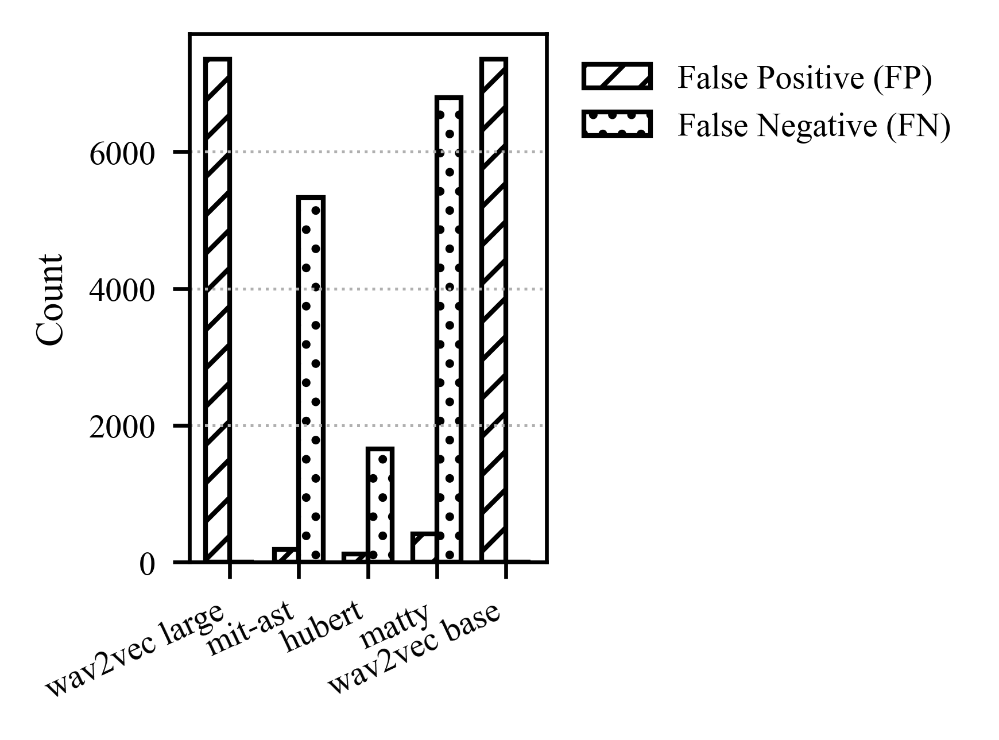
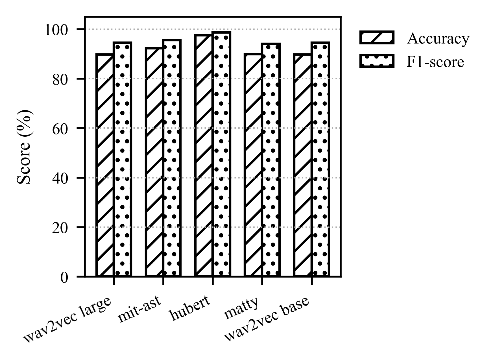

# ASVspoof 2019 LA SRN: Noise-Augmented Speaker Anti-Spoofing Experiments

## Project Purpose

This repository contains the experiment code used for the thesis project:

**A Noise-Augmented Dataset Construction for Robust Speaker Anti-Spoofing Model Training Based on ASVspoof 2019 LA**

The purpose of this project is to improve the robustness of speaker anti-spoofing models under noisy acoustic conditions. The original ASVspoof 2019 Logical Access (LA) dataset is augmented with real-world environmental noise to construct the **ASVspoof 2019 LA SRN** dataset.

This repository provides code for:

- Constructing the noise-augmented ASVspoof 2019 LA SRN dataset
- Fine-tuning multiple speaker anti-spoofing models
- Evaluating model performance after noise-augmented training
- Reproducing the main experimental results reported in the thesis

---

## Dataset and Model Links

### Dataset

The noise-augmented dataset is available on Hugging Face:

[AnodHuang/ASV_Spoof_2019_LA_SNR_50MB](https://huggingface.co/datasets/AnodHuang/ASV_Spoof_2019_LA_SNR_50MB)

### Fine-Tuned Model Versions

The fine-tuned SRN model checkpoints are available on Hugging Face:

- [AnodHuang/WAV2VEC-LARGE-SRN](https://huggingface.co/AnodHuang/WAV2VEC-LARGE-SRN)
- [AnodHuang/WAV2VEC-BASE-SRN](https://huggingface.co/AnodHuang/WAV2VEC-BASE-SRN)
- [AnodHuang/HUBERT-BASE-SRN](https://huggingface.co/AnodHuang/HUBERT-BASE-SRN)
- [AnodHuang/MATTY-AST-SRN](https://huggingface.co/AnodHuang/MATTY-AST-SRN)
- [AnodHuang/MIT-AST-SRN](https://huggingface.co/AnodHuang/MIT-AST-SRN)

---

## Technologies Used

This project uses the following tools and libraries:

- **Python**
  - Main programming language for data processing, training, and evaluation

- **PyTorch**
  - Deep learning framework used for model fine-tuning and inference

- **Hugging Face Transformers**
  - Used for loading and fine-tuning Wav2Vec2, HuBERT, and AST-based models

- **Hugging Face Datasets / Hub**
  - Used for storing and sharing the constructed dataset and model checkpoints

- **NumPy / SciPy**
  - Used for signal processing, RMS calculation, resampling, and SNR-based mixing

- **SoundFile**
  - Used for reading and writing audio files

- **scikit-learn**
  - Used for calculating evaluation metrics such as accuracy and F1 score

- **tqdm**
  - Used for progress display during dataset construction and evaluation

---

## Code Organization

The repository is organized as follows:

```text
ASVspoof-2019-LA-SRN/
├── README.md
├── requirements.txt
├── workbook.ipynb
├── train_ast.py
├── train_wav2vec_base.py
├── train_wav2vec_large.py
├── train_hubert.py
├── verify_ast.py
├── verify_wav2vec.py
├── verify_hubert.py
├── figures/
│   ├── ojsp_fp_fn.png
│   └── ojsp_acc_f1.png
└── results/
    └── evaluation_results.csv
```

### File Descriptions

| File | Description |
|---|---|
| `workbook.ipynb` | Constructs the ASVspoof 2019 LA SRN dataset by mixing clean ASVspoof audio with environmental noise |
| `train_ast.py` | Fine-tunes AST-based models, including MIT-AST and MattyB95-AST |
| `train_wav2vec_base.py` | Fine-tunes the Wav2Vec2-Base model |
| `train_wav2vec_large.py` | Fine-tunes the Wav2Vec2-Large model |
| `train_hubert.py` | Fine-tunes the HuBERT-Base model |
| `verify_ast.py` | Evaluates AST-based fine-tuned models |
| `verify_wav2vec.py` | Evaluates Wav2Vec2 fine-tuned models |
| `verify_hubert.py` | Evaluates HuBERT fine-tuned models |
| `figures/` | Stores result figures used in the thesis |
| `results/` | Stores evaluation tables and output metrics |

> Note: If the original local file names contain spaces or parentheses, such as `train_ast (1).py`, it is recommended to rename them before uploading to GitHub. Clean file names make the repository easier to reproduce and maintain.

---

## Dataset Construction

The dataset construction process can be summarized as:

```text
ASVspoof 2019 LA + Background-Noise-Detection Dataset
                       ↓
             ASVspoof 2019 LA SRN
```

The data processing script mixes clean ASVspoof 2019 LA utterances with real-world environmental noise.

The noise types include:

- Airport noise
- Subway noise
- Street noise

The SNR levels include:

```text
0 dB, 5 dB, 10 dB, 15 dB, 20 dB
```

For each clean utterance, the current augmentation script generates one noisy version for each SNR level.

---

## Set-Up Instructions

### 1. Clone the Repository

```bash
git clone https://github.com/AnodHuang/ASVspoof-2019-LA-SRN.git
cd ASVspoof-2019-LA-SRN
```

### 2. Create a Python Environment

```bash
python -m venv venv
```

Activate the environment.

For Windows:

```bash
venv\Scripts\activate
```

For macOS or Linux:

```bash
source venv/bin/activate
```

### 3. Install Dependencies

```bash
pip install -r requirements.txt
```

A typical `requirements.txt` should include:

```text
torch
torchaudio
transformers
datasets
numpy
scipy
soundfile
scikit-learn
tqdm
matplotlib
pandas
jupyter
```

---

## How to Run the Experiments

### 1. Construct the Noise-Augmented Dataset

Run the data processing notebook:

```bash
jupyter notebook workbook.ipynb
```

The notebook performs the following steps:

1. Load clean ASVspoof 2019 LA audio files
2. Load environmental noise files
3. Convert audio to mono
4. Resample noise when needed
5. Mix clean speech and noise at fixed SNR levels
6. Save the generated noisy audio files
7. Save a manifest file recording the generated samples

---

### 2. Fine-Tune AST-Based Models

```bash
python train_ast.py
```

This script is used for AST-based model fine-tuning, including:

- MIT-AST-SRN
- MATTY-AST-SRN

---

### 3. Fine-Tune Wav2Vec2 Models

For Wav2Vec2-Base:

```bash
python train_wav2vec_base.py
```

For Wav2Vec2-Large:

```bash
python train_wav2vec_large.py
```

---

### 4. Fine-Tune HuBERT

```bash
python train_hubert.py
```

---

### 5. Verify / Evaluate the Fine-Tuned Models

Verification scripts are included with the prefix `verify`.

Example:

```bash
python verify_ast.py
python verify_wav2vec.py
python verify_hubert.py
```

The evaluation scripts generate metrics such as:

- Accuracy
- F1 score
- False positives
- False negatives
- False positive rate
- False negative rate

---

## Experimental Results

The following table summarizes the main results after noise-augmented fine-tuning.

| Model | Accuracy | F1 Score | False Positives | False Negatives |
|---|---:|---:|---:|---:|
| Wav2Vec2-Large-SRN | 0.896753 | 0.945567 | 7355 | 0 |
| MIT-AST-SRN | 0.922498 | 0.954974 | 188 | 5333 |
| HuBERT-SRN | 0.975097 | 0.985947 | 121 | 1653 |
| MattyB95-SRN | 0.898845 | 0.940637 | 415 | 6791 |
| Wav2Vec2-Base-SRN | 0.896753 | 0.945567 | 7355 | 0 |

---

## Result Figures

### False Positives and False Negatives



### Accuracy and F1 Score



---

## Reproducibility Notes

The code and model checkpoints are provided to support experiment verification and reproducibility.

Important implementation details:

- The augmentation script randomly selects the noise category, noise file, and noise segment.
- The current version does not explicitly fix a random seed.
- Each clean utterance is mixed at five SNR levels: 0, 5, 10, 15, and 20 dB.
- The current manifest records the clean path, output path, SNR, noise category, and noise file path.
- Exact sample-level regeneration may require additionally storing the random seed and noise start position.
- The fine-tuned model checkpoints are uploaded to Hugging Face for independent verification.

---

## Limitations

The current implementation has several limitations:

1. The augmentation process does not explicitly enforce file-level noise separation between training, validation, and test splits.
2. The current manifest does not record the exact noise start position.
3. The current implementation does not explicitly fix a random seed.
4. Current evaluation mainly reports accuracy, F1 score, false positives, and false negatives.
5. Future work should include standard anti-spoofing metrics such as EER and min-tDCF.

These limitations should be addressed in future versions to improve reproducibility and robustness evaluation.

---

## Suggested Future Improvements

Future versions of this repository can be improved by adding:

- Fixed random seed support
- File-level train/validation/test noise separation
- Metadata recording for noise start position
- EER calculation
- min-tDCF calculation
- Noisy test set evaluation
- Reverberant test set evaluation
- A single command-line training and evaluation pipeline

---

## Thesis Reference

This repository supports the experiments in the following thesis:

```text
Kunyang Huang. A Noise-Augmented Dataset Construction for Robust Speaker Anti-Spoofing Model Training Based on ASVspoof 2019 LA. Bachelor of Science Thesis, Wenzhou-Kean University, 2026.
```

---

## Author

Kunyang Huang  
Bachelor of Science in Computer Science  
Wenzhou-Kean University

---

## License

This repository is intended for academic and research purposes only. Please follow the licenses of the original ASVspoof 2019 LA dataset, the Background-Noise-Detection Dataset, and all Hugging Face model checkpoints used in this project.
